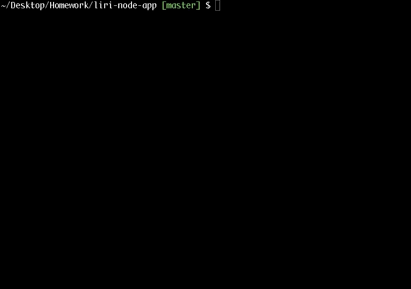
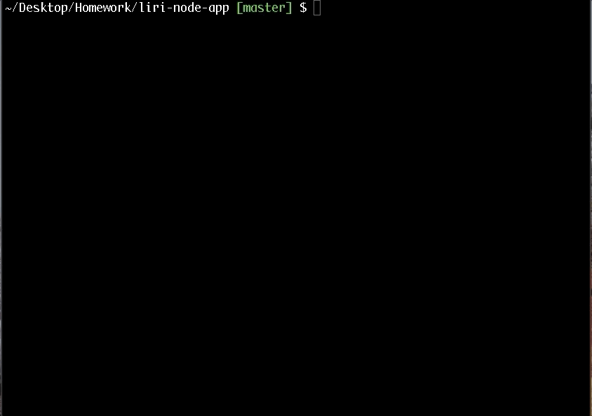
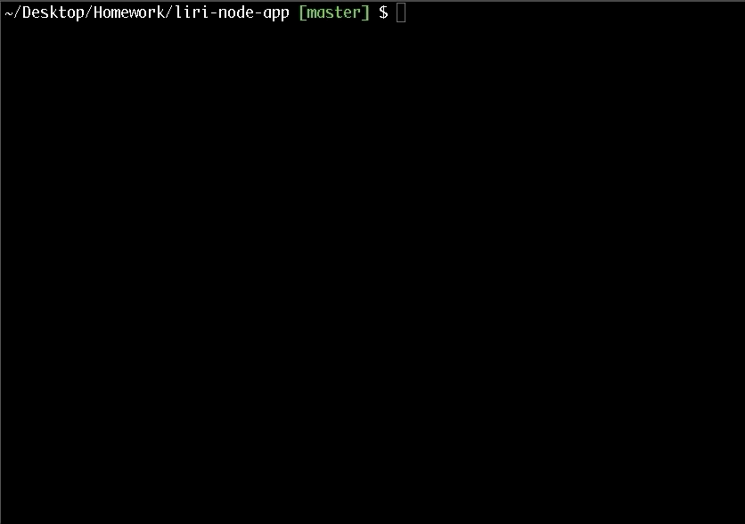

# liri-node-app

> LIRI is like iPhone's SIRI. However, while SIRI is a Speech Interpretation and Recognition Interface, LIRI is a Language Interpretation and Recognition Interface. LIRI will be a command line node app that takes in parameters and gives you a back data.

## Used Technologies

- [JavaScript](https://www.javascript.com/)
- [Node.js](https://nodejs.org)

## Node Package Manager (npm)

Using the axios package to retrieve data from APIs:

- <strong>Bands in Town API</strong> to render the name of the venue, the venue location and the date for each event.


```javascript
function concert() {
    axios.get("https://rest.bandsintown.com/artists/" + arg + "/events?app_id=codingbootcamp")
        .then(function (response) {
            var data = response.data[0]
            console.log("_____________CONCERT_____________")
            console.log("\n*", "Name of the venue:", data.venue.name.yellow + "\n*", "Venue location:", data.venue.city.yellow, data.venue.country.yellow, "\n*", "Date of the Event", data.datetime.yellow + "\n")
            console.log("_________________________________")
        })
}
```

- <strong>Spotify API</strong> to render the artist, the song's name, a preview link of the song and the album that the song is from.



```javascript
function spotify() {
    var spotify = new Spotify(keys.spotify);
    spotify.search({ type: 'track', query: arg }, function (err, data) {
        if (err) {
            return console.log('Error occurred: ' + err);
        }
        var jsonData = data.tracks.items[0];
        console.log("_____________MUSIC_____________")
        console.log("\n*", "Artist:", jsonData.artists[0].name.yellow, "\n*", "The song's name:", jsonData.name.yellow, "\n*", "A preview link of the song from Spotify:", jsonData.external_urls.spotify.yellow, "\n*", "The album the the song is from:", jsonData.album.name.yellow, "\n")
        console.log("_______________________________")
    });
}
```

- <strong>OMBD API</strong> to render the title of the movie, the year the movie came out, the IMDB rating, the rotten tomatoes rating,the country where the movie was produced, the language, the plot and the actors in the movie.



```javascript
function omdbapi() {
    var queryUrl = "http://www.omdbapi.com/?t=" + (arg === "" ? "Mr. Nobody" : arg) + "&y=&plot=short&apikey=trilogy";

    axios.get(queryUrl).then(
        function (response) {
            var jsonData = response.data
            console.log("_____________MOVIE_____________")
            console.log("\n*", "Title:", jsonData.Title.rainbow.bold, "\n*", "Year the movie came out :", jsonData.Year.yellow,
                "\n*", "IMDB Rating:", jsonData.imdbRating.yellow, "\n*", "Rotten Tomatoes Rating:", jsonData.Ratings[0].Value.yellow,
                "\n*", "Country where the movie was produced:", jsonData.Country.yellow, "\n*", "Language(s):", jsonData.Language.yellow, "\n*", "Plot:", jsonData.Plot.yellow, "\n*", "Actors", jsonData.Actors.yellow, "\n");
            console.log("_______________________________")
        })
```

Use the fs Node package to retrieve the text inside of random.txt and then use it to call one of LIRI's commands.



```javascript
function doWhatItSays() {
    fs.readFile("random.txt", "utf8", function (error, data) {
        if (error) {
            console.log(error);
        } else {
            var fileArgs = data.split(",");
            command = fileArgs[0];
            arg = fileArgs[1];
            liri();
        }
    });
```

## Author

Victoire Baron 
